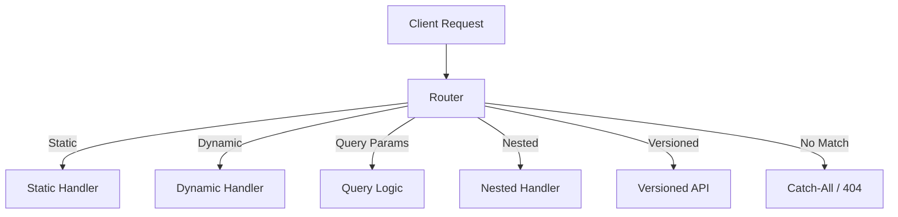

Routing represents the intent of a request.
It decides where the request should go and which backend logic should handle it.

Routing is how a backend server decides **which code should run for a given URL**.
When a request comes in, routing acts like a map — it reads the path, method, and params, then sends the request to the right handler.

Think of routing as the **traffic controller** of your backend.

---

## 1. Static Routes

A static route has a fixed path.

Example: `/login`, `/health`

- Simple and predictable
- No parameters involved

---

## 2. Dynamic Routes

Dynamic routes contain variables in the path.

Example: `/users/:id`

- Used when data changes per request
- Common for resources like users, posts, orders

---

## 3. Query Parameters

Query params are key-value pairs added after `?`.

Example: `/search?query=ai&page=2`

- Optional and flexible
- Great for filters, pagination, sorting

---

## 4. Nested Routes

Nested routes represent relationships between resources.

Example: `/users/:id/posts`

- Shows hierarchy clearly
- Keeps APIs clean and readable

---

## 5. Versioned Routes

Versioning helps evolve APIs without breaking old clients.

Example: `/api/v1/users`

- Safe upgrades
- Multiple versions can run together

---

## 6. Catch‑All Routes

Catch‑all routes match anything not handled earlier.

Example: `/*`

- Used for 404 pages or SPA fallbacks
- Must be defined last

---

## How Routing Flows (Mermaid Reference)

---

### In short

Routing gives structure, clarity, and control to your backend.
Good routing makes APIs **easy to use, easy to scale, and hard to break**.
