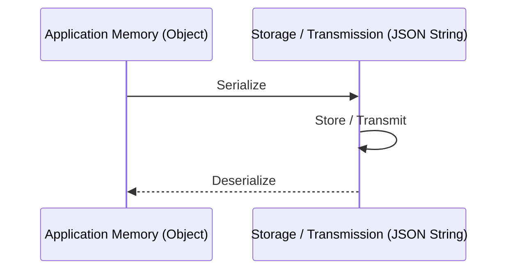
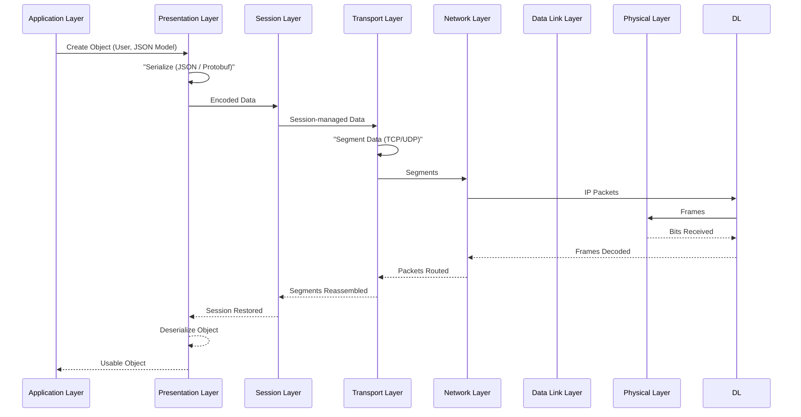

## Serialization and Deserialization

### What is Serialization?

**Serialization** is the process of converting in-memory data (objects, classes, structures) into a format that can be **sent over the network or stored**.

Common formats:

- JSON
- XML
- Protobuf
- MessagePack

> Example: A JavaScript object → JSON string

---

### What is Deserialization?

**Deserialization** is the reverse process.

It converts the received data back into a **usable in-memory object**.

> Example: JSON string → JavaScript object

---



### Serialization (Object → JSON)

```tsx
// JavaScript/TypeScript object
const user = {
  id: 1,
  name: 'John Doe',
  email: 'john@example.com',
  active: true,
  createdAt: new Date('2024-01-01'),
  preferences: {
    theme: 'dark',
    notifications: true,
  },
}

// Serialize to JSON string
const json = JSON.stringify(user, null, 2)
console.log(json)
// Output:
// {
//   "id": 1,
//   "name": "John Doe",
//   "email": "john@example.com",
//   "active": true,
//   "createdAt": "2024-01-01T00:00:00.000Z",
//   "preferences": {
//     "theme": "dark",
//     "notifications": true
//   }
// }
```

### Deserialization (JSON → Object)

```tsx
// JSON string from API/file
const json = '{"id":1,"name":"John Doe","email":"john@example.com"}'

// Deserialize to JavaScript object
const user = JSON.parse(json)
console.log(user.name) // "John Doe"
console.log(user.email) // "john@example.com"

// Handle parsing errors
try {
  const data = JSON.parse(jsonString)
  return data
} catch (error) {
  console.error('Invalid JSON:', error)
  return null
}
```

---

## Why Serialization is Needed

- Networks can only transfer **bytes**, not objects
- Different systems use different languages
- Ensures data is **portable, structured, and readable**

---

## Data Flow (High Level)



---

## Deserialization on the Receiver Side

1. Bits are received from the network
2. Data moves up the OSI layers
3. **Presentation layer deserializes the data**
4. Application layer uses the object

---

## In Simple Words

- **Serialization** = object → bytes (send)
- **Deserialization** = bytes → object (use)
- OSI model defines **where this transformation logically happens**

---

### One-Line Interview Answer

> **Serialization converts application data into transferable formats at the presentation layer, while deserialization reconstructs it back for application use.**
