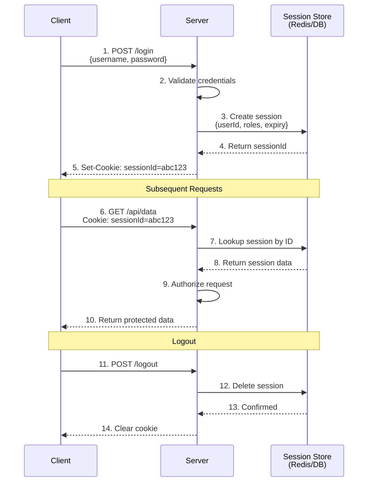
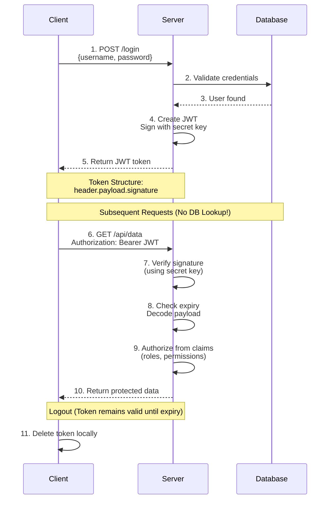
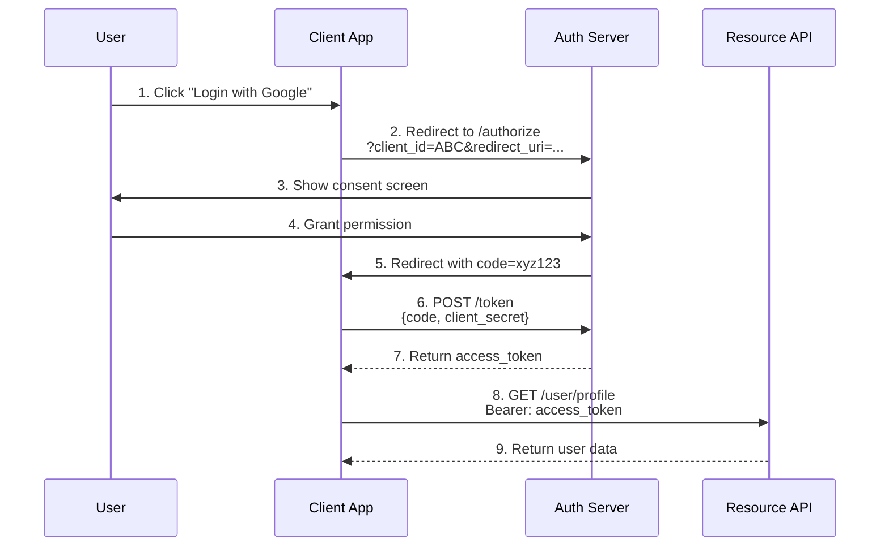
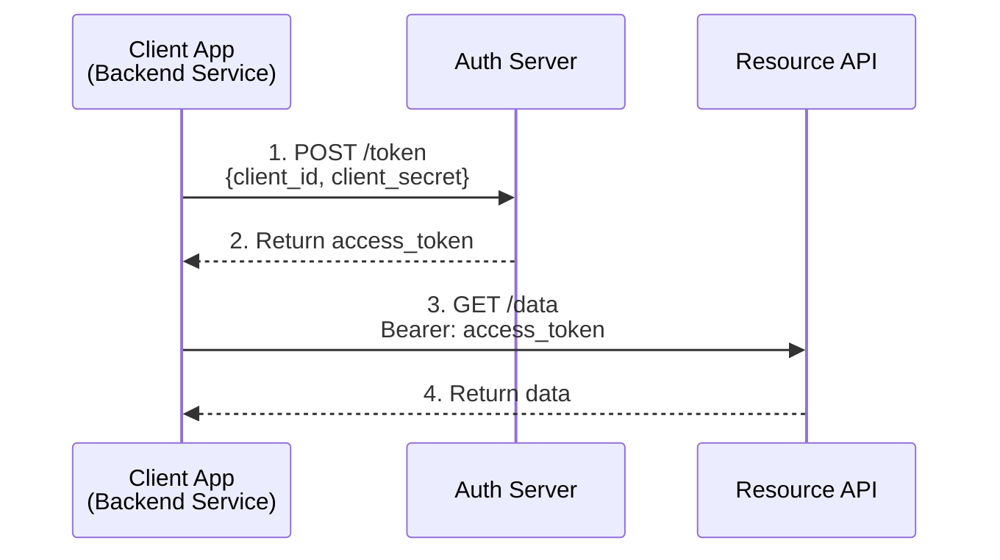
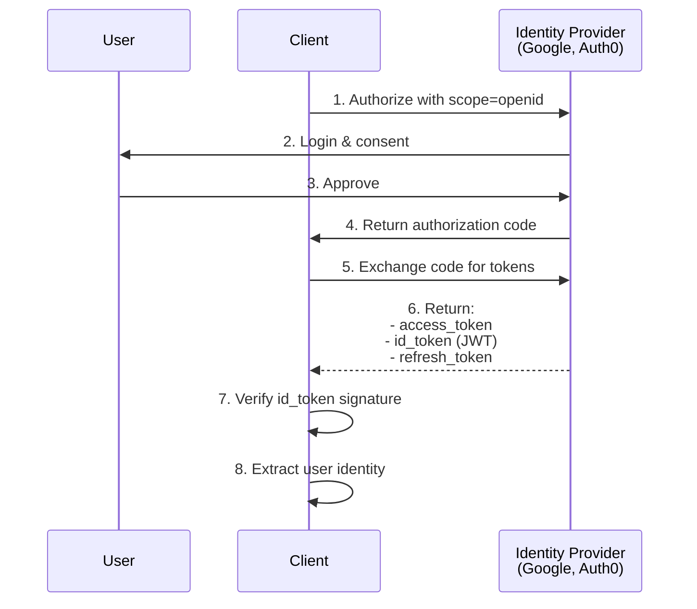
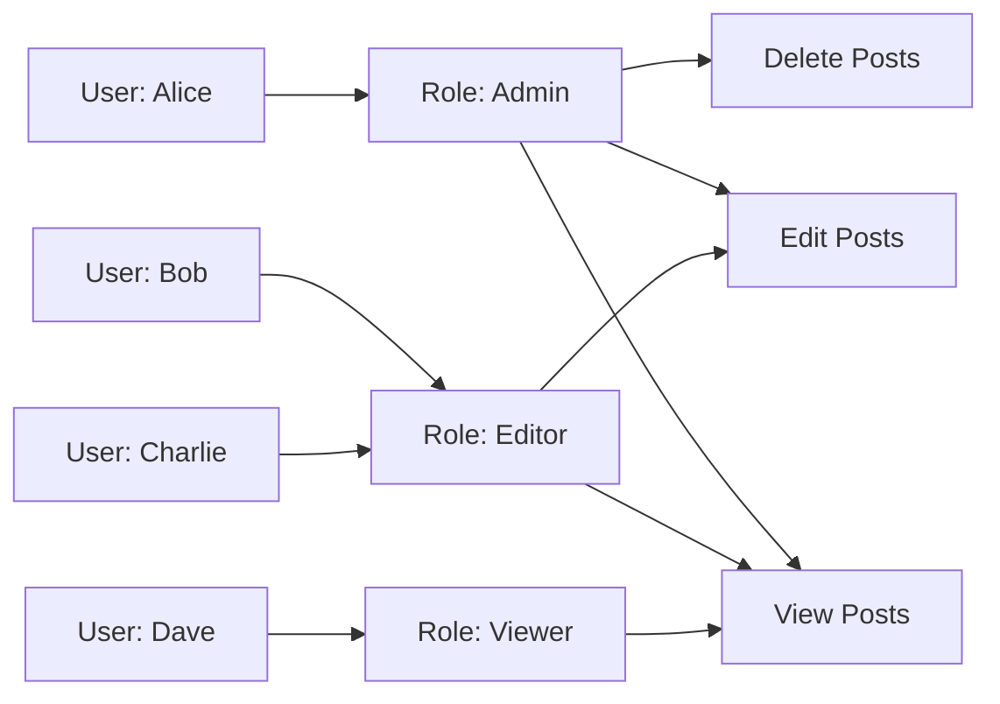
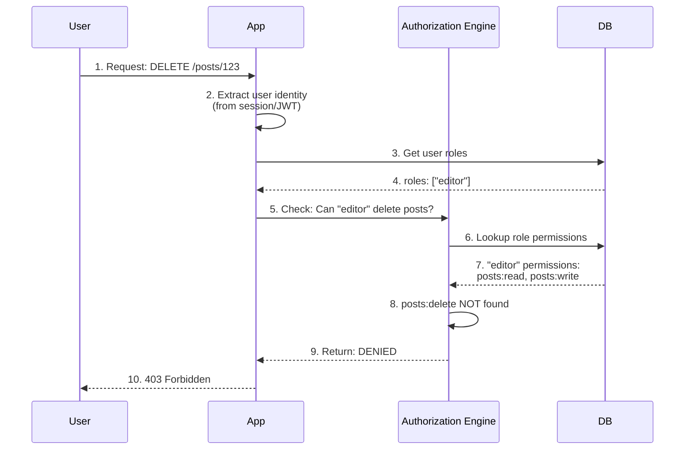
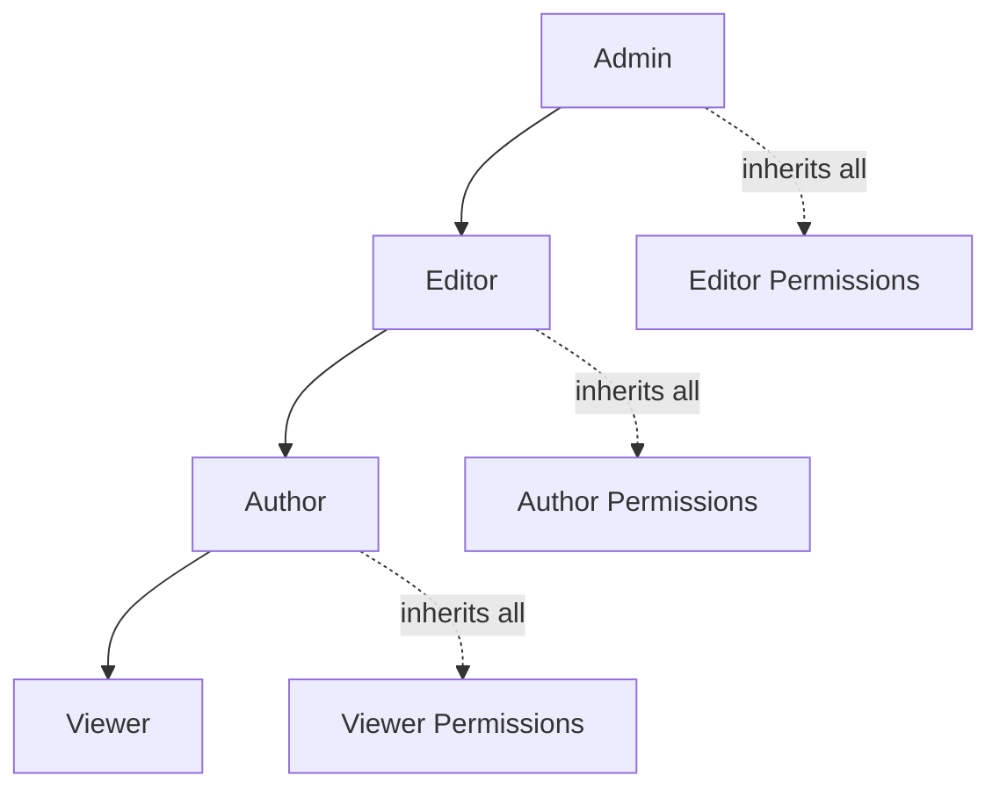

## Core Idea

- **Authentication** → _Who you are_
- **Authorization** → _What you are allowed to do_

Example:

- Login proves you are **Alice** (authentication)
- Access to `/admin` proves you have **admin role** (authorization)

---

## 1. Authentication vs Authorization

| Aspect         | Authentication      | Authorization           |
| -------------- | ------------------- | ----------------------- |
| Question       | Who are you?        | What can you do?        |
| Happens when   | Before access       | After identity is known |
| Data used      | Credentials, tokens | Roles, policies         |
| Failure result | 401 Unauthorized    | 403 Forbidden           |

Authentication proves **identity**. Authorization enforces **policy**.

---

## 2. Historical Evolution of Authentication

### 2.1 Mainframe Era

Early systems were centralized and trusted internal users.

- Single machine (mainframe)
- Users logged in via terminals
- Passwords stored **as-is** in memory or disk

**Why it failed:**

- Anyone with file access could read passwords
- No isolation
- No network threat model

---

### 2.2 Password Hashing Era (Security Foundation)

Instead of storing passwords, systems store **password hashes**.

#### How hashing works

1. User creates a password
2. System generates a random **salt**
3. `hash = H(password + salt)`
4. Store `{salt, hash}` only

During login:

- Input password is hashed again
- Compared with stored hash

#### Why salting matters

- Prevents rainbow table attacks
- Makes same passwords hash differently

#### Modern password hashing algorithms

| Algorithm | Why used             |
| --------- | -------------------- |
| bcrypt    | Slow by design       |
| scrypt    | Memory hard          |
| argon2    | Modern & recommended |

---

## 3. PKI (Public Key Infrastructure)

PKI solves the problem: **How do I trust who I’m talking to?**

### Core idea

- Each entity has a **key pair**
- Public key is shared
- Private key is secret

### Certificates

A certificate binds:

- Identity (domain / org)
- Public key
- Signature of trusted CA

### Where PKI is used

- HTTPS (TLS)
- Client authentication
- Secure APIs

PKI enables **secure authentication without shared secrets**.

---

## 4. Kerberos (Ticket-Based Authentication)

Kerberos was built for **large internal networks**.

### How Kerberos works (simplified)

1. User authenticates once to KDC
2. Receives a **ticket**
3. Ticket is used to access services
4. Password never travels again

Kerberos introduced the idea of **temporary tokens**, which inspired modern auth systems.

---

## 5. The Scalability Problem

Modern systems are:

- Distributed
- Horizontally scaled
- Cloud-based
- Mobile-first

### Why classic sessions broke

- Server memory not shared
- Load balancers route randomly
- State tied to machine

**Result:** Token-based authentication became necessary.

---

## 6. Session-Based Authentication

### How sessions actually persist data

**Key idea:** The server owns identity state.

#### Login flow

1. User sends credentials
2. Server validates
3. Server creates a **session object**
4. Session stored in persistent store
5. Session ID sent to client



#### Example session object

```json
{
  "sessionId": "s_9fa3...",
  "userId": 101,
  "roles": ["admin"],
  "createdAt": 1700000000,
  "expiresAt": 1700003600
}
```

#### Persistence layer evolution

| Storage           | Why it was used | Problem      |
| ----------------- | --------------- | ------------ |
| File              | Easy            | Not scalable |
| Database          | Persistent      | Slower       |
| Distributed store | Shared          | Complex      |
| Redis             | Fast + TTL      | Needs infra  |

#### Why Redis works well

- In-memory speed
- Automatic expiration
- Shared across servers

**Revocation is instant** → delete session key.

---

## 7. JWT Authentication

### JWT core idea

**Server does NOT store identity.**

The token itself carries the claims.



#### JWT structure

| Part      | What it contains   |
| --------- | ------------------ |
| Header    | Algorithm, type    |
| Payload   | User data (claims) |
| Signature | Tamper protection  |

#### Example JWT breakdown

**Header:**

```json
{
  "alg": "HS256",
  "typ": "JWT"
}
```

**Payload:**

```json
{
  "sub": "101",
  "role": "admin",
  "iat": 1700000000,
  "exp": 1700003600
}
```

**Signature:**

```
HMACSHA256(
  base64UrlEncode(header) + "." + base64UrlEncode(payload),
  secret_key
)
```

#### How JWT persists identity

- Stored on client
- Sent on every request
- Server verifies signature only

No DB lookup. No session store.

#### JWT storage options

| Location         | Risk              |
| ---------------- | ----------------- |
| LocalStorage     | XSS risk          |
| Memory           | Page refresh loss |
| HTTP-only cookie | Best option       |

---

## 8. JWT vs Session (Why JWT Alone Is Dangerous)

| Problem     | Session   | JWT          |
| ----------- | --------- | ------------ |
| Revocation  | Easy      | Hard         |
| Logout      | Immediate | Needs expiry |
| Role change | Immediate | Token stale  |

JWT **cannot be revoked unless you track state**.

---

## 9. Hybrid Authentication (REAL WORLD PATTERN)

**This is what large systems actually use.**

### How hybrid works

- Short-lived access token (JWT)
- Long-lived refresh token (stateful)

Refresh token stored in:

- DB or Redis

Access token expires quickly → limits damage
Refresh token allows controlled renewal

---

## 10. OAuth: The Problem It Solved

### Before OAuth

You wanted to let an app access your Gmail contacts. The only way:

1. Give the app your Gmail password
2. App logs in as you
3. **Problem:** App has full access to everything

**Issues:**

- Password sharing is insecure
- No way to revoke access
- App can do anything you can do

### The OAuth Solution

> "Let app access data without sharing password"

Instead of passwords, OAuth uses **temporary, limited-scope tokens**.

---

## 11. OAuth History & Evolution

### OAuth 1.0 (2007-2010)

**Purpose:** Twitter needed 3rd-party apps to post tweets without passwords.

**How it worked:**

- Complex cryptographic signatures
- HMAC-SHA1 signing every request
- No JSON support

**Why it failed:**

```
Complex signature generation:
oauth_signature = HMAC-SHA1(
  base_string,
  consumer_secret + "&" + token_secret
)
```

Developers found it too difficult to implement correctly.

---

### OAuth 2.0 (2012-Present)

**Key changes:**

- Removed signature requirement
- Requires HTTPS instead
- Bearer tokens (simple to use)
- JSON support
- Multiple grant types

**Result:** Industry standard adoption

| Platform  | Uses OAuth 2.0 |
| --------- | -------------- |
| Google    | ✅             |
| Facebook  | ✅             |
| GitHub    | ✅             |
| Microsoft | ✅             |
| Spotify   | ✅             |

---

## 12. OAuth 2.0 Core Concepts

### OAuth roles

| Role                 | Description       | Example      |
| -------------------- | ----------------- | ------------ |
| Resource Owner       | User              | You          |
| Client               | App               | Mobile app   |
| Authorization Server | Identity provider | Google OAuth |
| Resource Server      | API               | Gmail API    |

### Important distinction

OAuth **is NOT authentication by itself** — it's **authorization**.

- Authentication = Who you are
- Authorization = What you can access

---

## 13. OAuth 2.0 Grant Types

### 13.1 Authorization Code Flow (Most Secure)

Used by: Web apps with backend servers



**Why it's secure:**

- Authorization code is temporary (1-time use)
- Client secret never exposed to browser
- Access token only on backend

---

### 13.2 Implicit Flow (Deprecated)

**Warning:** No longer recommended. Use Authorization Code + PKCE instead.

Used by: Single-page apps (old pattern)

**Why deprecated:**

- Token exposed in URL fragment
- No client authentication
- XSS vulnerability

---

### 13.3 Client Credentials Flow

Used by: Server-to-server communication



**Use case:**

- Microservices authentication
- Background jobs
- Server-to-server APIs

**No user involved** — app authenticates itself.

---

### 13.4 Authorization Code + PKCE

**PKCE** = Proof Key for Code Exchange

Used by: Mobile apps, SPAs (modern pattern)

**Problem PKCE solves:**

- Mobile/SPA apps can't securely store client_secret
- Attackers could intercept authorization code

**How PKCE works:**

1. Client generates random `code_verifier`
2. Client creates `code_challenge = SHA256(code_verifier)`
3. Send `code_challenge` with authorization request
4. Auth server stores challenge
5. Client exchanges code + `code_verifier` for token
6. Server verifies: `SHA256(code_verifier) == code_challenge`

**Result:** Authorization code is useless without the verifier.

---

## 14. OAuth Scopes

Scopes define **what the token can access**.

### Example scopes

| Scope          | Allows              |
| -------------- | ------------------- |
| `read:user`    | Read user profile   |
| `write:repo`   | Create/edit repos   |
| `admin:org`    | Manage organization |
| `openid email` | Get user email      |

### In practice

```http
GET /authorize?
  client_id=abc123&
  redirect_uri=https://app.com/callback&
  scope=read:user write:repo&
  response_type=code
```

User sees: "App wants to read your profile and create repos"

---

## 15. OpenID Connect (OIDC)

OAuth 2.0 provides authorization. **OIDC adds authentication**.

### What OIDC adds

| Feature  | What it provides     |
| -------- | -------------------- |
| ID Token | User identity (JWT)  |
| UserInfo | Endpoint for profile |
| Scopes   | `openid`, `profile`  |

### OIDC flow



### ID Token structure

```json
{
  "iss": "https://accounts.google.com",
  "sub": "110169484474386276334",
  "aud": "your-client-id",
  "exp": 1700003600,
  "iat": 1700000000,
  "email": "user@example.com",
  "email_verified": true,
  "name": "John Doe"
}
```

**OIDC = OAuth 2.0 + Identity layer**

---

## 16. Advanced Authentication Models

| Model        | Explanation           |
| ------------ | --------------------- |
| Zero Trust   | Verify every request  |
| Passwordless | Magic links, passkeys |
| Web3         | Wallet-based identity |

---

## 17. Decentralized & Future Authentication

### Behavioral biometrics

- Typing rhythm
- Cursor movement
- Touch pressure

Used as **continuous auth**, not login replacement.

### Post-quantum crypto

- Quantum computers break RSA/ECC
- New algorithms required

---

## 18. Authorization Models

### Why Authorization Matters

Authentication tells you **who** the user is.
Authorization determines **what** they can do.

### Common Authorization Models

| Model     | Description                       | Use Case         |
| --------- | --------------------------------- | ---------------- |
| **ACL**   | Access Control Lists              | File systems     |
| **RBAC**  | Role-Based Access Control         | Enterprise apps  |
| **ABAC**  | Attribute-Based Access Control    | Complex rules    |
| **ReBAC** | Relationship-Based Access Control | Social platforms |

---

## 19. RBAC (Role-Based Access Control)

### Core Concept

Instead of assigning permissions to each user individually, you assign **roles**.



**Key idea:** Manage permissions at the role level, not user level.

---

### RBAC Components

| Component      | Definition                      | Example                        |
| -------------- | ------------------------------- | ------------------------------ |
| **User**       | Entity performing actions       | alice@company.com              |
| **Role**       | Named collection of permissions | `admin`, `editor`, `viewer`    |
| **Permission** | Specific action on resource     | `posts:delete`, `users:create` |
| **Resource**   | Object being protected          | Post #123, User profile        |

---

### RBAC Request Flow



### Hierarchical RBAC

Some roles inherit from others.



---

### RBAC Best Practices

| Practice                      | Why                             | Example                                 |
| ----------------------------- | ------------------------------- | --------------------------------------- |
| **Least Privilege**           | Give minimum needed access      | New user gets `viewer` by default       |
| **Separation of Duties**      | No single role has full control | Finance role can't approve own requests |
| **Regular Audits**            | Remove unused roles/permissions | Quarterly access review                 |
| **Role Explosion Prevention** | Don't create too many roles     | Use groups/teams instead                |
| **Resource Ownership**        | Users can edit own content      | Author can edit own posts               |

---

### RBAC vs ABAC (When to Use What)

| Scenario                             | Use RBAC | Use ABAC |
| ------------------------------------ | -------- | -------- |
| Enterprise application               | ✅       |          |
| Simple permission model              | ✅       |          |
| Dynamic rules (time, location)       |          | ✅       |
| Context-dependent access             |          | ✅       |
| Regulatory compliance (fine-grained) |          | ✅       |

**ABAC Example:**

```json
{
  "rule": "Allow if user.department == resource.department AND time.hour >= 9 AND time.hour <= 17"
}
```

RBAC is simpler and works for 90% of applications.

---

### Common RBAC Mistakes

| Mistake                       | Problem                    | Solution                      |
| ----------------------------- | -------------------------- | ----------------------------- |
| **Role per user**             | Defeats purpose of RBAC    | Group users into common roles |
| **Hardcoding roles**          | Hard to change             | Store in database             |
| **No audit logs**             | Can't track access changes | Log all permission checks     |
| **Checking on frontend only** | Insecure                   | Always enforce on backend     |
| **Too many roles**            | Hard to manage             | Combine similar roles         |

---

## 20. Security Practices That Actually Matter

| Area                  | Why                  |
| --------------------- | -------------------- |
| Generic errors        | Prevent enumeration  |
| Constant-time compare | Avoid timing attacks |
| Token expiry          | Reduce blast radius  |
| Least privilege       | Minimize damage      |

---

## Final Mental Model (Remember This)

- Sessions → **server owns identity**
- JWT → **client owns identity**
- Hybrid → **shared control**

> Most production systems use **hybrid auth**.

---
