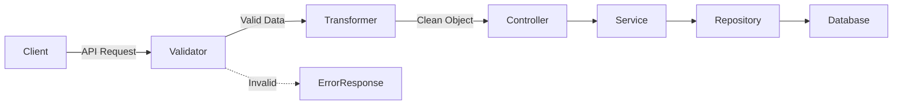

## What is Validation?

Validation is the step where incoming data is **checked before business logic runs**. It ensures the request is safe, correct, and meaningful.

In a backend flow, validation usually happens **after the request hits the API and before it reaches controllers/services**.

### Why Validation is Important

- Prevents bad or malicious data
- Avoids runtime errors
- Keeps business logic clean
- Improves API reliability

---

## Types of Validation

### 1. Syntactic Validation (Structure Check)

Checks **how data looks**.

**Examples:**

- Required fields are present
- Correct JSON format
- String length, min/max values

```ts
{
  "email": "user@example.com",
  "age": 25
}
```

✔ `email` exists
✔ `age` is a number

❌ Missing fields or invalid format → rejected here

---

### 2. Type Validation (Data Type Check)

Ensures values are of the **expected type**.

**Examples:**

- `age` must be a number
- `isAdmin` must be boolean
- `createdAt` must be a date

```ts
age: number
isActive: boolean
```

❌ `age: "twenty"` → invalid

---

### 3. Semantic Validation (Meaning Check)

Checks **if data makes sense in real life**.

**Examples:**

- Email must be unique
- User must exist in DB
- Start date must be before end date

```ts
startDate < endDate
```

✔ Structure is valid
✔ Types are valid
❌ Logic is invalid → rejected here

---

## What is Transformation?

Transformation means **changing data into a format your system understands and uses internally**.

It happens **after validation** and **before business logic**.

---

## Why Transformation is Needed

- Convert raw input into domain models
- Normalize data
- Remove unnecessary fields
- Prepare data for services & database

---

## Common Transformations

### 1. Type Conversion

```ts
"25" → 25
"true" → true
```

### 2. Rename Fields

```ts
user_name → userName
```

### 3. Add Derived Fields

```ts
fullName = firstName + lastName
```

### 4. Remove Extra Fields

```ts
{
  ;(email, password)
} // drop unknown fields
```

### 5. Format Standardization

```ts
email → lowercase
phone → E.164 format
```

---

## Validation + Transformation Flow (Mermaid)



---

## Where This Fits in Your Diagram

- **Validation Layer**
  - Syntactic
  - Type
  - Semantic

- **Transformation Layer**
  - DTO → Domain Model
  - Clean & normalized data

- **Controller**
  - No validation logic
  - Just orchestration

- **Service**
  - Pure business rules

---

## Simple Rule to Remember

> **Validate for correctness, transform for usefulness.**

---
