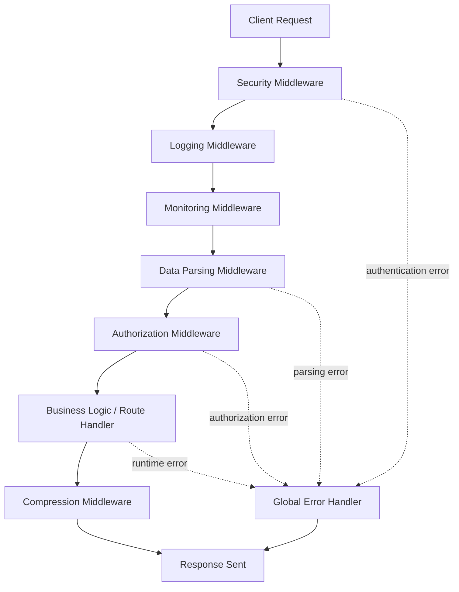

## What is Middleware?

A **middleware** is a small function that runs **between the client request and the final response** in a backend system.

Think of it like a **security + helper layer** that can:

- Read the request
- Modify the request or response
- Stop the request
- Pass it to the next step

Middleware is heavily used in **Node.js (Express, Fastify, Hono)** and modern backend frameworks.

---

## Why Middleware is Important

- Keeps code **clean and reusable**
- Separates concerns (security, logging, parsing, etc.)
- Makes applications **scalable and maintainable**

---

## Types of Middleware

### 1. Security Middleware

**Purpose:** Protect the application from attacks.

**What it does:**

- Validates authentication tokens
- Checks authorization (roles, permissions)
- Prevents common attacks

**Examples:**

- Helmet (secure HTTP headers)
- CORS handling
- Rate limiting
- CSRF protection

**Flow idea:**

> Request → Security Check → Allow / Reject

---

### 2. Logging Middleware

**Purpose:** Track what is happening in the system.

**What it does:**

- Logs HTTP method, URL, status code
- Records request time
- Helps in debugging

**Examples:**

- Morgan
- Winston logger

**Why useful:**

- Debug errors
- Understand user behavior

---

### 3. Monitoring Middleware

**Purpose:** Observe system health and performance.

**What it does:**

- Measures response time
- Tracks CPU / memory usage
- Collects metrics

**Examples:**

- Prometheus metrics
- OpenTelemetry

---

### 4. Data Parsing Middleware

**Purpose:** Convert incoming data into usable format.

**What it does:**

- Parses JSON body
- Parses form data
- Parses cookies

**Examples:**

- JSON body parser
- URL-encoded parser
- Cookie parser

**Without this:**

> Request body would be raw text or binary

---

### 5. Compression Middleware

**Purpose:** Reduce response size for faster delivery.

**What it does:**

- Compresses response using gzip / brotli
- Improves network performance

**Result:**

- Faster load time
- Less bandwidth usage

---

### 6. Global Error Handling Middleware

**Purpose:** Handle errors in one central place.

**What it does:**

- Catches errors from any middleware or route
- Sends clean error responses
- Prevents server crash

**Example errors handled:**

- Validation errors
- Authentication failures
- Internal server errors

---

## Middleware Execution Order

Middleware runs **top to bottom** in the order it is registered.

If a middleware does NOT call `next()`:

- Request stops there
- Response is sent

---

## Middleware Flow

---

## Simple Summary

- Middleware is the **pipeline of backend processing**
- Each middleware has **one clear responsibility**
- Order matters
- Errors are handled centrally

---
