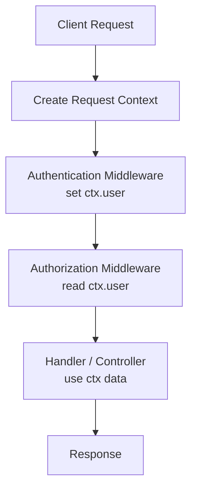

## What is Request Context?

**Request Context** is a shared object that lives **for the entire lifetime of a single request**.

It carries important information that all middlewares and handlers can access.

Think of it as a **backpack attached to the request** that moves through the system.

---

## What Goes Inside Request Context?

Common data stored in request context:

- Request ID (trace id)
- Authenticated user details
- User roles and permissions
- Session / token info
- Locale and timezone
- Correlation IDs for logs
- Custom flags (isAdmin, isPremium)

---

## Why Request Context is Important

### 1. Shared State Across Middleware

Instead of recalculating or re-fetching data:

- One middleware sets the value
- Others reuse it

Example:

- Auth middleware sets `ctx.user`
- Authorization middleware reads `ctx.user.roles`

---

### 2. Clean & Decoupled Code

Without context:

- Functions depend on each other directly
- Code becomes tightly coupled

With context:

- Each middleware does **one job**
- No need to pass data manually

---

### 3. Logging & Tracing

Request context allows:

- Same request ID in all logs
- Easy debugging across services

This is critical in:

- Microservices
- Distributed systems

---

### 4. Security & Authorization

Context stores:

- Authenticated user
- Permissions
- Token claims

Authorization becomes simple:

> Read from context → Decide → Allow / Deny

---

### 5. Performance Optimization

- Avoid duplicate DB calls
- Cache per-request data

Example:

- User loaded once
- Used everywhere in the request flow

---

## Request Context Flow (Mermaid Diagram)



---

## Where Context Exists in Real Frameworks

| Framework | Context Name     |
| --------- | ---------------- |
| Express   | req, res         |
| Fastify   | request, reply   |
| Hono      | c (context)      |
| NestJS    | ExecutionContext |

---

## Node.js (Express) – Short Code

```js
// request context = req
app.use((req, res, next) => {
  req.user = { id: 1, role: 'admin' } // set context
  next()
})

app.get('/admin', (req, res) => {
  res.json(req.user) // read context
})
```

---

## Go (net/http) – Short Code

```go
// request context = context.Context
ctx := context.WithValue(r.Context(), "user", "admin")
r = r.WithContext(ctx)

user := r.Context().Value("user") // read context
```

## Context Lifetime

- Created at request start
- Destroyed after response
- Never shared between requests

This makes it:

- Safe
- Predictable
- Thread-safe

---

## Common Mistakes

- Storing global data in context
- Mutating context without rules
- Using context outside request scope

---

## Simple Summary

- Request context = **request-scoped memory**
- Enables clean middleware communication
- Critical for auth, logging, tracing, and performance

---
