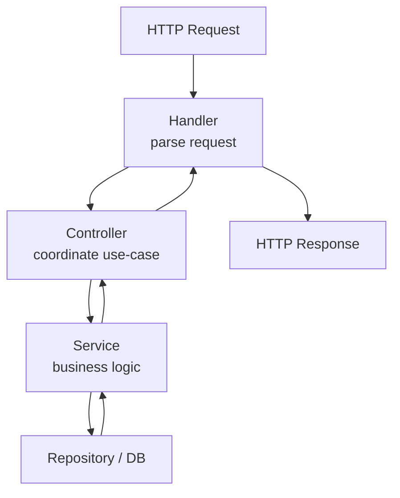

## Big Picture

Handlers, Controllers, and Services help **separate responsibilities** in backend systems.

This separation makes code:

- Easy to read
- Easy to test
- Easy to scale

---

## 1. Handler

### What is a Handler?

A **Handler** is the **first code that receives the HTTP request**.

It is framework-facing and deals with:

- Request (`req`, `context`)
- Response (`res`)
- Calling controller or service

### Handler Responsibilities

- Read request data (params, body, headers)
- Call the controller
- Send HTTP response

### What Handler should NOT do

- Business logic ❌
- Database queries ❌

---

## 2. Controller

### What is a Controller?

A **Controller** coordinates between **handler and service**.

It represents a **use case** of the application.

### Controller Responsibilities

- Validate input (basic)
- Call one or more services
- Handle application-level decisions

### What Controller should NOT do

- Direct database access ❌
- HTTP-specific work ❌

---

## 3. Service

### What is a Service?

A **Service** contains the **core business logic**.

It is framework-independent and reusable.

### Service Responsibilities

- Business rules
- Data processing
- Interact with database/repositories

### What Service should NOT do

- Read HTTP request ❌
- Return HTTP response ❌

---

## Request Flow (High Level)

---

## Detailed Flow with Responsibilities

---

## Simple Analogy

- **Handler** → Reception desk (takes request)
- **Controller** → Manager (decides what to do)
- **Service** → Worker (does real work)

---

## Why This Separation Matters

- Easy unit testing (services can be tested alone)
- Easy framework change
- Clean architecture
- Better team collaboration

---

## Common Mistakes

- Putting business logic in handlers
- Calling database directly from controllers
- Mixing HTTP logic inside services

---

## One-line Summary

- Handler handles HTTP
- Controller handles use-case
- Service handles business logic

---
